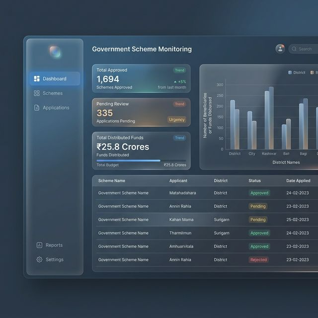

# 🏛️ Government Scheme Monitoring System (GSMS)



## 📌 Project Overview
The **Government Scheme Monitoring System (GSMS)** is a high-transparency, role-based governance platform designed to streamline the lifecycle of public welfare schemes. From initial field verification to final fund disbursement, GSMS ensures accountability, data isolation, and real-time oversight across multiple administrative levels.

---

## 🚀 The Challenge (Problem Statement)
Public welfare distribution often faces critical bottlenecks:
- **Lack of Transparency**: Difficulty in tracking the exact stage of an application.
- **Data Overload**: Officers overwhelmed by data outside their jurisdiction.
- **Accountability Gaps**: Missing audit trails for why applications were approved or rejected.
- **Manual Inefficiencies**: Fragmented communication between field units and central administration.

## 💡 The Solution
GSMS provides a **unified, multi-tenant digital ecosystem** that solves these issues through:
1.  **Strict Data Isolation**: District and Field Officers only manage data within their assigned regions, preventing information clutter and ensuring security.
2.  **Linear Approval Workflow**: A robust 3-stage verification process:
    - **Field Officer**: On-ground verification and document checking.
    - **District Officer**: Regional review and forwarding.
    - **System Admin**: Final audit and fund disbursement.
3.  **Auditable Remarks History**: Every decision point includes mandatory officer notes, creating a permanent, transparent history for every beneficiary.
4.  **Actionable Intelligence**: Real-time dashboards provide heatmaps and performance metrics for admins to monitor scheme efficacy across the state.

---

## ✨ Key Features
- **🔐 Secure RBAC (Role-Based Access Control)**: Custom-tailored views for Admin, District, and Field roles.
- **📊 Real-time Analytics**: High-fidelity charts showing scheme targets, budget consumption, and district health.
- **📝 Officer Registry**: Automated registration flow for new officers with regional assignments.
- **🔔 Notification Hub**: Instant alerts for high-priority review tasks and approval milestones.
- **✨ Premium UI/UX**: Professional "Glassmorphism" design system optimized for clarity and focus.

---

## 🛠️ Technical Excellence (Tech Stack)

### **Frontend**
- **React 18**: Component-based architecture with Vite for high performance.
- **Lucide React**: Modern, consistent iconography.
- **Vibrant Glassmorphism**: Custom CSS design system for a premium look and feel.
- **Axios & Context API**: Efficient state management and API communication.

### **Backend**
- **Node.js & Express**: High-concurrency server architecture.
- **MongoDB & Mongoose**: Flexible, scalable document-based data storage.
- **JWT & Bcrypt.js**: Industry-standard authentication and password security.
- **Nodemon**: Optimized development workflow.

---

## 📦 Installation & Setup

### **Prerequisites**
- Node.js (v16 or higher)
- MongoDB (Local or Atlas)

### **1. Clone & Install**
```bash
git clone https://github.com/Neemasree/Government-scheme-monitoring-system.git
cd Government-scheme-monitoring-system
```

### **2. Backend Setup**
Create a `.env` file in the `Backend` directory:
```env
PORT=5000
MONGO_URI=your_mongodb_connection_string
JWT_SECRET=your_jwt_secret
NODE_ENV=development
```
Install dependencies and seed the database:
```bash
cd Backend
npm install
npm run seed
npm run dev
```

### **3. Frontend Setup**
```bash
cd ../Frontend
npm install
npm run dev
```

---

## 👤 Author
**Neema Sree**
*Aspiring Software Engineer focused on building impactful digital solutions for public infrastructure.*

---

*GSMS was built to bridge the gap between policy and people through technology.*
